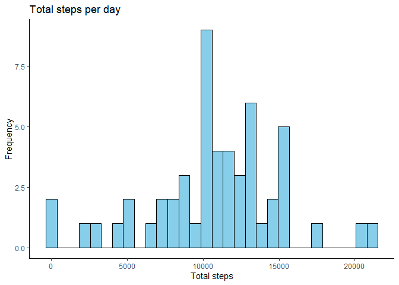
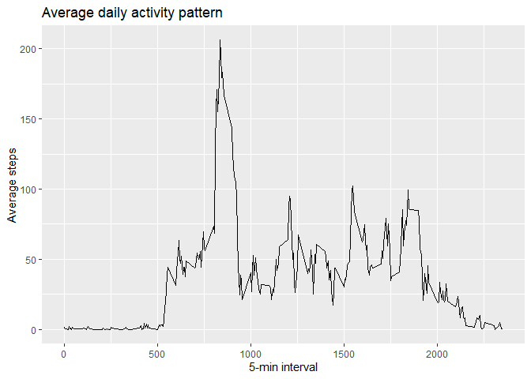
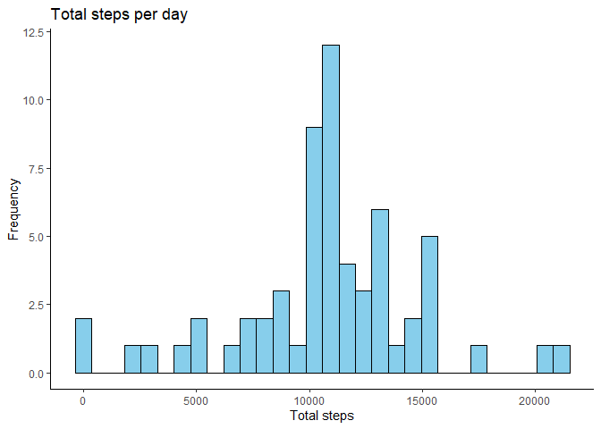
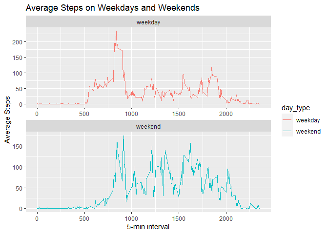

## Loading and preprocessing the data


```r
library(dplyr)
```

```
## 
## 다음의 패키지를 부착합니다: 'dplyr'
```

```
## The following objects are masked from 'package:stats':
## 
##     filter, lag
```

```
## The following objects are masked from 'package:base':
## 
##     intersect, setdiff, setequal, union
```

```r
library(ggplot2)

unzip("activity.zip")
act <- read.csv("activity.csv", sep=",", head=TRUE)
act$date <- as.Date(act$date)
```

## What is mean total number of steps taken per day?

1. Calculate the total number of steps taken per day

```r
total_step <- act %>% group_by(date) %>% 
    summarise(total_steps = sum(steps))
```

2. Make a histogram of the total number of steps taken each day

```r
ggplot(total_step, aes(x=total_steps)) +
    geom_histogram(fill="skyblue", color="black") +
    labs(title = "Total steps per day",
        x = "Total steps",
        y = "Frequency") +
    theme_classic()
```

```
## `stat_bin()` using `bins = 30`. Pick better value with `binwidth`.
```

```
## Warning: Removed 8 rows containing non-finite values (`stat_bin()`).
```

<!-- -->

3. Calculate and report the mean and median of the total number of steps taken per day

```r
mean_day <- mean(total_step$total_steps, na.rm=TRUE)
median_day <- median(total_step$total_steps, na.rm=TRUE)
cat("Mean:", mean_day)
```

```
## Mean: 10766.19
```

```r
cat("Median:", median_day)
```

```
## Median: 10765
```


## What is the average daily activity pattern?

1. Make a time series plot

```r
ave_step <- act %>% group_by(interval) %>%
    summarize(ave_steps = mean(steps, na.rm=TRUE))

ggplot(data=ave_step, aes(x= interval, y= ave_steps))+
    geom_line() +
    labs(title = "Average daily activity pattern",
          x = "5-min interval",
          y = "Average steps")
```

<!-- -->

2. Which 5-minute interval, on average across all the days in the dataset, contains the maximum number of steps?


```r
max_interval <- ave_step$interval[which.max(ave_step$ave_steps)]
cat(max_interval, "is 5-minute interval containing the maximum number of steps.")
```

```
## 835 is 5-minute interval containing the maximum number of steps.
```


## Imputing missing values

1. Calculate and report the total number of missing values in the dataset

```r
na_count <- sum(is.na(act))
cat("The total number of missing values is", na_count)
```

```
## The total number of missing values is 2304
```

2. Create a new dataset that is equal to the original dataset but with the missing data filled in.

```r
merge <- left_join(act, ave_step, by="interval")

act_imputed <- merge %>%
    mutate(steps = if_else(is.na(steps), ave_steps, steps)) %>%
    select(-ave_steps)
```

3. Make a histogram of the total number of steps taken each day

```r
total_step2 <- act_imputed %>% group_by(date) %>%
      summarize(total_steps = sum(steps))
      
ggplot(total_step2, aes(x=total_steps)) +
    geom_histogram(fill="skyblue", color="black") +
    labs(title = "Total steps per day",
        x = "Total steps",
        y = "Frequency") +
    theme_classic()
```

```
## `stat_bin()` using `bins = 30`. Pick better value with `binwidth`.
```

<!-- -->

4. Calculate and report the mean and median total number of steps taken per day.

```r
t_mean <- mean(total_step2$total_steps)
t_median <- median(total_step2$total_steps)

cat("Mean:", t_mean)
```

```
## Mean: 10766.19
```

```r
cat("Median:", t_median)
```

```
## Median: 10766.19
```

Mean and median values from imputed data are very similar to ones from the estimates.
I used average steps by interval across the days to impute missing values. This imputing strategy has little effect on the estimates of the total daily number of steps.


## Are there differences in activity patterns between weekdays and weekends?

1. Create a new factor variable in the dataset with two levels – “weekday” and “weekend” indicating whether a given date is a weekday or weekend day.

```r
Sys.setlocale(category = "LC_TIME", locale = "en_US.UTF-8")
```

```
## [1] "en_US.UTF-8"
```

```r
day_of_week <- weekdays(act$date)

act$day_type <- ifelse(day_of_week %in% c("Saturday", "Sunday"), "weekend", "weekday")
act$day_type <- factor(act$day_type, levels = c("weekday", "weekend"))
```

2. Make a panel plot containing a time series plot of the 5-minute interval (x-axis) and the average number of steps taken, averaged across all weekday days or weekend days (y-axis).

```r
week_ave_step <- act %>% group_by(day_type, interval) %>%
      summarize(week_ave_step = mean(steps, na.rm=TRUE))
```

```
## `summarise()` has grouped output by 'day_type'. You can override using the
## `.groups` argument.
```

```r
ggplot(week_ave_step, aes(x=interval, y=week_ave_step, group = day_type)) +
      geom_line(aes(color = day_type)) +
      labs(title = "Average Steps on Weekdays and Weekends",
            x= "5-min interval", y="Average Steps") +
      facet_wrap(~day_type, nrow=2, scales="free")
```

<!-- -->
